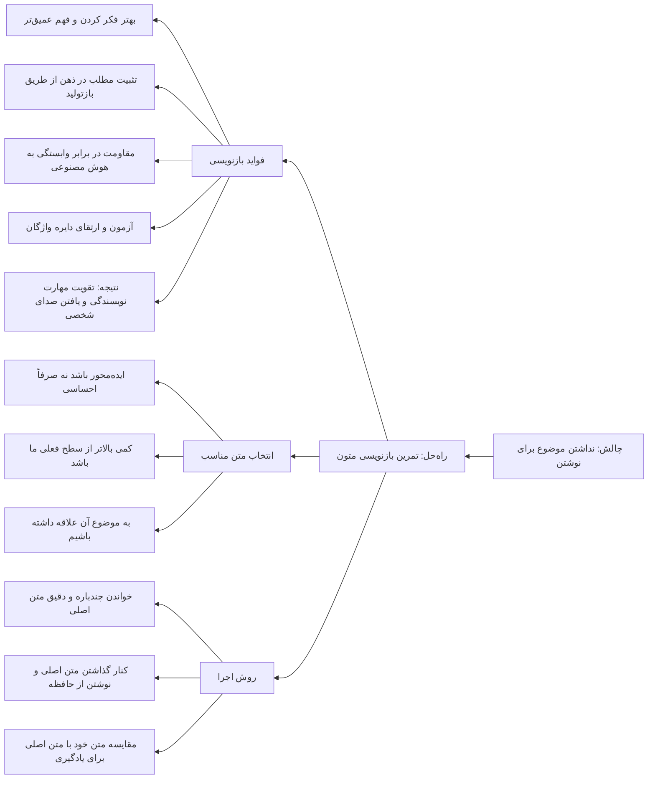

نوشتن، بر خلاف تصور رمانتیک بسیاری از تازه‌کارها، همیشه با جرقه‌های الهام و ایده‌های بکر شروع نمی‌شود. واقعیت میدانیِ میز تحریر اغلب این است: ما نشسته‌ایم، نشانگر چشمک‌زن در صفحه سفید منتظر است، و ذهن‌مان به طرز آزاردهنده‌ای خالی است. اما چه می‌شود اگر به جای انتظار برای الهام، از مسیری برویم که هم به ما کمک می‌کند موضوع پیدا کنیم و هم هم‌زمان عضلات نویسندگی‌مان را قوی‌تر کند؟ یکی از بهترین و در عین حال نادیده‌گرفته‌شده‌ترین تمرین‌ها برای خروج از بن‌بستِ «چه بنویسم؟»، بازنویسی متون دیگران است.

در نگاه اول شاید این کار کم‌اهمیت یا حتی تقلیدی به نظر برسد، اما در عمل دقیقاً برعکس است. وقتی متنی را برمی‌دارید و سعی می‌کنید آن را با زبان خودتان بنویسید، در حال انجام یک فرایند عمیق ذهنی هستید که از یادگیری تا خلاقیت را در بر می‌گیرد. بیایید این تمرین را از زوایای مختلف بررسی کنیم و ببینیم چرا باید آن را جدی بگیریم.

## چرا اصلاً بازنویسی کنیم؟

اولین و شاید سطحی‌ترین فایده بازنویسی، حل مشکل «موضوع نداشتن» است. همیشه متنی، کتابی، مقاله‌ای یا حتی پست وبلاگی وجود دارد که به آن برخورده‌ایم و برایمان جالب بوده است. به جای اینکه صرفاً آن را بخوانیم و رها کنیم، می‌توانیم آن را به عنوان ماده خام تمرین خود قرار دهیم. اما این فایده فقط نوک کوه یخ است. زیر سطح آب، اتفاقات بسیار مهم‌تری در حال رخ دادن است.

وقتی تصمیم می‌گیرید متنی را بازنویسی کنید، اولین اتفاق این است که مجبور می‌شوید بهتر فکر کنید. خواندن یک متن، حتی خواندن دقیق، همیشه به معنای فهمیدن کامل آن نیست. ذهن ما عادت دارد از روی کلمات بپرد و به یک برداشت کلی بسنده کند. اما وقتی می‌خواهید همان مطلب را با زبان خودتان بنویسید، دیگر نمی‌توانید با برداشت کلی سر کنید. باید دقیقاً بفهمید نویسنده چه گفته، چرا گفته، استدلالش چیست و ارتباط بین اجزای متن چگونه برقرار شده است. این فرایند شبیه به باز کردن یک موتور ماشین و دوباره سر هم کردن آن است؛ بعد از این کار، دیگر آن موتور برای شما یک جعبه سیاه نیست.

این موضوع را می‌توان با مدل‌های یادگیری نیز توضیح داد. یکی از معروف‌ترین این مدل‌ها، هرم یادگیری است که اغلب به مؤسسه NTL (National Training Laboratories) نسبت داده می‌شود. بر اساس این مدل، روش‌های منفعل مثل سخنرانی فقط حدود ۵٪ ماندگاری یادگیری دارند، در حالی که «تمرینِ انجام دادن کار واقعی» حدود ۷۵٪ و «آموزش دادن به دیگران» حدود ۹۰٪ ماندگاری ایجاد می‌کند. بازنویسی یک متن، دقیقاً همان «تمرینِ انجام دادن کار واقعی» است. شما در حال تبدیل دانشِ خوانده‌شده به مهارتِ نوشتن هستید. باید توجه داشت که اعداد دقیق این هرم از نظر علمی بارها مورد تردید قرار گرفته و خود NTL نیز ادعای مالکیت آن را رد کرده است، اما اصل ماجرا که یادگیری فعال مؤثرتر از یادگیری منفعل است، تقریباً در تمام پژوهش‌های علوم شناختی تأیید شده است.

فایده بعدی، تثبیت موضوع در ذهن است. در فرایند بازنویسی، شما یک بار مطلب را می‌خوانید، یک بار درباره‌اش فکر می‌کنید و یک بار هم با زبان خودتان می‌نویسید. این سه مرحله مثل سه میخ هستند که یک تابلو را به دیوار ذهن شما محکم می‌کنند. دیگر آن مطلب به راحتی از خاطرتان نمی‌رود. این تثبیت به این دلیل رخ می‌دهد که شما صرفاً اطلاعات را ذخیره نکرده‌اید، بلکه آن را بازتولید کرده‌اید. مغز اطلاعاتی را که خودش تولید می‌کند، بسیار ارزشمندتر از اطلاعاتی می‌داند که صرفاً دریافت می‌کند.

در دنیای امروز، یک دلیل بسیار مهم دیگر برای انجام این تمرین وجود دارد: مقاومت در برابر وابستگی به هوش مصنوعی. امروزه ابزارهای مبتنی بر هوش مصنوعی می‌توانند در چند ثانیه متنی را بنویسند که از نظر گرامری و حتی سبکی، شاید از نوشته ما بهتر باشد. اگر همیشه برای نوشتن به سراغ این ابزارها برویم، به تدریج قوه تفکر و نوشتن خودمان را تعطیل می‌کنیم. مثل این است که همیشه با ماشین به مقصد برویم و بعد از چند سال تعجب کنیم چرا دیگر نمی‌توانیم یک کیلومتر هم پیاده بدویم. بازنویسی دستی، مثل دویدن است. شاید کندتر و سخت‌تر باشد، اما عضلاتی را می‌سازد که ماشین هرگز نمی‌تواند بسازد. جالب است که حتی وقتی از هوش مصنوعی استفاده می‌کنیم، می‌توانیم آن را وارد این تمرین کنیم. می‌توانیم از هوش مصنوعی بخواهیم یک متن اولیه به ما بدهد و سپس ما آن را با زبان خودمان بازنویسی کنیم. این کار شبیه به پارافریز کردن متن است که بیشتر در مقالات علمی رایج است. اما هدف ما در این تمرین چیزی فراتر از تغییر کلمات برای فرار از سرقت ادبی است؛ هدف ما یادگیری و تقویت مهارت است.

نکته دیگر درباره هوش مصنوعی این است که معمولاً کاربرد آن را برعکس می‌بینیم. خیلی‌ها اول با زبان خودشان یک پیش‌نویس می‌دهند و از هوش مصنوعی می‌خواهند متن نهایی را با جملات بهتر تحویل دهد. این کار برای تولید خروجی خوب عالی است. اما تمرینی که ما از آن صحبت می‌کنیم، مسیر معکوس است. ما متن «خوب» را می‌گیریم و سعی می‌کنیم خودمان آن را تولید کنیم. اینجا هدف، خروجی نیست؛ هدف، فرایند است. ما می‌خواهیم در این فرایند، توانایی درونی خودمان را ارتقا دهیم.

علاوه بر همه اینها، بازنویسی یک آزمون واقعی برای دایره واژگان ماست. وقتی می‌نویسیم، متوجه می‌شویم که برای بیان یک مفهوم خاص، چقدر کلمه در اختیار داریم. آیا می‌توانیم همان ایده‌ای را که نویسنده با یک واژه تخصصی بیان کرده، با زبان ساده‌تر یا اصطلاحات دیگری بگوییم؟ اینجا با انبوهی از «واژگان منفعل» مواجه می‌شویم؛ کلماتی که معنایشان را می‌دانیم، وقتی می‌خوانیم‌شان می‌فهمیم، اما هرگز در نوشته یا صحبت خودمان از آنها استفاده نمی‌کنیم. بازنویسی، پلی است برای انتقال این کلمات از انبار منفعل ذهن به کالاهای فعال و در دسترس. هر بار که در حین بازنویسی گیر می‌کنیم و به دنبال کلمه مناسب می‌گردیم، در واقع در حال جابه‌جا کردن کلمات از قفسه‌های خاک‌خورده به ویترین اصلی ذهن هستیم. با تکرار این تمرین، آن کلمات کم‌کم به بخشی از دایره واژگان روزمره ما تبدیل می‌شوند.

## چه متنی برای بازنویسی مناسب است؟

هر متنی لزوماً برای این تمرین مناسب نیست. یک متن خوب برای بازنویسی، باید چند ویژگی داشته باشد. اول اینکه باید «ایده محور» باشد، نه صرفاً «احساس محور». متنی که صرفاً یک حال و هوا را توصیف می‌کند، شاید بازنویسی‌اش تمرین خوبی برای تکنیک‌های توصیفی باشد، اما متنی که یک ایده، استدلال یا مفهوم را منتقل می‌کند، چالش فکری بسیار بیشتری ایجاد می‌کند. چون شما را مجبور می‌کند با منطق و ساختار استدلالی نویسنده درگیر شوید.

دومین ویژگی این است که متن باید از نظر کیفیت، بالاتر از سطح فعلی شما باشد. اگر متنی را بازنویسی کنید که از خودتان ضعیف‌تر است، چیزی یاد نمی‌گیرید؛ فقط ممکن است اشتباهاتش را هم تکرار کنید. متن ایده‌آل، متنی است که کمی از شما بهتر است. این متن شما را به چالش می‌کشد، دایره واژگان و ساختارهای جمله‌بندی‌تان را می‌آزماید و در عین حال آنقدر هم پیچیده نیست که کاملاً دلسرد شوید. این مفهوم در روان‌شناسی یادگیری به «منطقه توسعه تقریبی» (Zone of Proximal Development) معروف است؛ جایی که کار با کمی کمک و تلاش انجام‌شدنی است.

سوم، بهتر است متنی انتخاب کنید که به آن علاقه دارید یا موضوعش برایتان مهم است. بازنویسی یک متن خسته‌کننده در موضوعی که به آن هیچ علاقه‌ای ندارید، نه تنها لذت‌بخش نیست، بلکه احتمال رها کردنش هم بالاست. وقتی موضوع برایتان جذاب باشد، انگیزه برای بهتر نوشتن و عمیق‌تر فکر کردن به شکل طبیعی ایجاد می‌شود.

## چگونگی بازنویسی: راهنمای گام به گام

حالا که می‌دانیم چرا و چه چیزی را بازنویسی کنیم، سؤال اصلی این است: چگونه؟ اولین و مهم‌ترین قدم این است که متن اصلی را چند بار با دقت بخوانید. بار اول فقط برای فهم کلی. بار دوم با دقت بیشتر، هایلایت کردن نکات کلیدی و ایده‌های اصلی. بار سوم با تمرکز بر ساختار: نویسنده از کجا شروع کرده، به کجا رسیده و چطور نتیجه گرفته است؟ این مرحله را نباید دست‌کم گرفت. اگر متن را خوب نفهمیده باشید، بازنویسی شما فقط یک کپی بی‌روح خواهد بود.

بعد از خواندن، متن اصلی را کنار بگذارید. این نکته بسیار حیاتی است. اگر متن جلوی چشمتان باشد، ناخودآگاه از کلمات و جملات آن استفاده می‌کنید و کارتان به جای بازنویسی، به رونویسی تبدیل می‌شود. هدف این است که با تکیه بر فهم و حافظه خودتان بنویسید. نگران فراموش کردن جزئیات نباشید؛ فراموشی بخشی از فرایند است. شما مجبور می‌شوید خلأها را با تفکر خودتان پر کنید و همین، جوهره یادگیری است.

حالا شروع به نوشتن کنید. نگران نباشید که متن شما در ابتدا چقدر خام و ناشیانه به نظر می‌رسد. هدف از این بازنویسی، تولید یک متن بی‌نقص نیست. هدف، عبور از آن فرایند ذهنی است. سعی کنید ساختار کلی متن اصلی را حفظ کنید، اما کلمات، مثال‌ها و استدلال‌ها را از زبان خودتان بیان کنید. می‌توانید مثال‌های خودتان را جایگزین مثال‌های نویسنده کنید، یا یک مفهوم را با تجربه شخصی خود پیوند بزنید. این کار خلاقیت شما را هم فعال می‌کند.

پس از نوشتن نسخه اولیه، آن را کنار بگذارید و سپس متن خودتان را با متن اصلی مقایسه کنید. این مرحله، مرحله یادگیری طلایی است. ببینید کجاها از کلمات ضعیف‌تری استفاده کرده‌اید. کجاها ساختار جمله‌تان شکسته است. کجاها نتوانسته‌اید مفهوم را به خوبی منتقل کنید. این مقایسه به شما نشان می‌دهد که دقیقاً کجای کارتان میلنگد و باید روی چه مهارتی بیشتر تمرین کنید. شاید متوجه شوید که در انتقال مفاهیم انتزاعی ضعیف هستید، یا دایره واژگانتان در یک حوزه خاص محدود است. این خودشناسی برای رشد نویسندگی بسیار ارزشمندتر از خواندن ده‌ها کتاب تئوری است.

در نهایت، این تمرین را به صورت منظم انجام دهید. لازم نیست هر روز یک مقاله کامل را بازنویسی کنید. حتی بازنویسی یک پاراگراف خوب در روز، می‌تواند تأثیر شگرفی در بلندمدت داشته باشد. با گذشت زمان، متوجه خواهید شد که نوشتن برایتان روان‌تر شده، کلمات راحت‌تر به ذهن‌تان می‌آیند و درک بهتری از ساختار متن پیدا کرده‌اید. نوشتن، بیش از آنکه یک استعداد ذاتی باشد، یک مهارت اکتسابی است و این مهارت از طریق تمرین‌هایی مثل بازنویسی ساخته می‌شود.

## نکته‌ای درباره اخلاق بازنویسی

یک نکته اخلاقی مهم را هم نباید فراموش کرد. بازنویسی متون دیگران برای تمرین و یادگیری شخصی، کاملاً پذیرفته و حتی توصیه‌شده است. اما اگر قرار است خروجی این تمرین را جایی منتشر کنید، حتماً باید به متن اصلی ارجاع دهید یا از نویسنده اصلی اجازه بگیرید. بازنویسی نباید به ابزاری برای سرقت ادبی تبدیل شود. هدف این تمرین، ساختن توانایی درونی خودمان است، نه کپی کردن زحمات دیگران. همیشه منبع الهام خود را مشخص کنید.

در پایان، می‌توان گفت بازنویسی یکی از در دسترس‌ترین و در عین حال عمیق‌ترین تمرین‌ها برای هر کسی است که می‌خواهد بهتر بنویسد. این تمرین به ما یادآوری می‌کند که نوشتن در خلأ اتفاق نمی‌افتد؛ ما همیشه وام‌دار نویسندگانی هستیم که قبل از ما آمده‌اند و بهترین راه برای قدردانی از آنها، این است که با متن‌شان گفتگو کنیم و از دل آن، صدای خودمان را پیدا کنیم.

---

## ۱۰ عنوان جذاب برای این مطلب

1. بازنویسی متون؛ تمرینی که نویسنده درونتان را بیدار می‌کند
2. وقتی موضوعی برای نوشتن ندارید، متن دیگران را قرض بگیرید
3. چطور با بازنویسی، هم یاد بگیریم و هم بهتر بنویسیم؟
4. راز نویسنده‌های قوی: از روی دست دیگران نوشتن
5. چرا باید نوشتن را با متن دیگران تمرین کنیم؟
6. بازنویسی؛ آن تمرین نادیده‌گرفته‌شده‌ای که معجزه می‌کند
7. از خواندن تا نوشتن: پلی به نام بازنویسی
8. چطور بدون ایده، یک جلسه نویسندگی پربار داشته باشیم؟
9. بازنویسی متون؛ باشگاه خصوصی تقویت ذهن و قلم
10. این تمرین ساده، شما را از هوش مصنوعی بی‌نیاز می‌کند